# 1. Introducing KRR

## 1.1. What is it?

* KRR - Knowledge Representation and Reasoning

* KRR - concerns
  * representation of knowledge in a form suitable for computational manipulation and exchange
  * together with the use of reasoning to process knowledge represented in this way to both
    * generate new knowledge and
    * uncover properties of existing knowledge

## 1.2 Main concepts

### What is inference or reasoning?

* Reasoning is computation with symbols representing statements (propositions), rather than with numerals

* Inputs are combined with the rules of a process (operator in numerical terms) to produce output

  * numerical 2, 4 $\rightsquigarrow$ 6 (process=add)
  * reasoning `if it is a bank holiday then the weather is bad` (P $\rightarrow$ Q), `it is a bank holiday` ($P$) $\rightsquigarrow$ `so the weather is bad`
  * the above can expressed just using symbols as well $P \rightarrow Q$, $P$ $\rightsquigarrow Q$

### What is knowledge?

1. Things that can be known
2. Alternatively, the relationship between `agent` (knower) and a `proposition` (claim about the world)

> **Propositions** are statements that are either true or false

### What is representation?

* In KRR context - representation is a modelling something that such that handling the model is better suited to our purpose than handling the thing itself

* example is London underground map - many details like direction, distance, etc are missing but still good for its purpose (finding the route)

### What is knowledge representation?

* appropriate encoding and utilisation of information in computational models of cognition
* such encodings are
  * symbolic
  * unambiguous
  * explicit

* often involves
  * syntax
  * semantics (not often evident in implementation)
  * inference

## 1.3 Why do we need KR?

* One big reason is explainable AI
  * one that not just carries out complex task but explain why it came to a particular decision
    * this is important to avoid bias and discrimination
  * example, the program diagnosed faulty bulb because the wire and the switch are working correctly

## 1.4 Semantic technology

### RDF (Resource Description Framework)

* a way to represent knowledge using triples
  * Paper is made from wood
  * (subject)(predicate)(object)
  * advantage is we can use use graph to represent this
    * node for subject and object
    * directed edge for predicate

### Ontology

* is an engineering artifact - usually a model of (some aspect) the world
* introduces vocabularies describing various aspects of the domain being modelled
* provides explicit specification of the intended meaning of the vocabulary
* RDF is limited as Ontology language due to its lack of expressiveness
  * i.e. statements that are useful to make cannot be expressed using RDF
* OWL (Web Ontology Language) is a standard design from W3C for Semantic Web is much more expressive than RDF

#### OWL

* uses `Description Logics`(DLs) based on first-order logic

## 1.7 Aspects of logics

* **Entailment** is a logical relationship between two statements (propositions)

* For example, the truth of one statement (the premise) logically guarantees the truth of another statement (the conclusion)

### There are three types of reasoning

#### Deduction

* inferring logical truths

$$
\text{All birds fly} \\
\text{Crow is a bird} \\
\therefore \text{Crow flies}
$$

#### Induction

* not same as mathematical induction
* generalising from examples

$$
 \text{Crow flies} \\
\text{Crow is a bird} \\
\therefore \text{All birds fly}
$$

#### Abduction

* explaining observation from background theory

$$
\text{All birds fly} \\
\text{Crow flies} \\
\therefore \text{Crow is a bird}
$$

### Variety of logics

* Propositional logic
  * only things manipulated are propositions

* First order logic
  * aka predicate logic or predicate calculus
  * allows quantification over the collection of individuals
  * allows use of variable - when variable is used it is predicate
  * and when variable is substituted with values, it becomes proposition

* Higher order logics
  * quantification over sets of sets, etc...

* Modal logics
  * proposition such as necessity and possibility (think of modal dialog)

* Non monotonic logics
  * Unlike classical logic where new information can only lead to expansion of knowledge (monotonicity), non-monotonic logic allows retraction/modification of previously drawn conclusion

### Inference and computation

* **intractable** - not possible for conventional computer to find a solution in reasonable time using reasonable resources

* **undecidable** - not possible to terminate in finite time after having determined that no solution exists

## 1.8 Basic math terminologies

* **Sets** - collection of distinct things without any order
  * empty set notation $\{\}$ or $\empty$
  * $\in$ means `is an element of` $ 2 \in \{1, 2, 3\}$
  * $\cap$ - intersection
  * $\cup$ - union
  * $\times$ - cartesian product - set of all possible ordered pair
    * $ A = \{a, b\}, B= \{1, 2\}, A \times B = \{(a, 1), (a, 2), (b,1), (b, 2)\} $
  * difference $A-B$ - items in A but not in B
  * $A \sub B$ - A is a proper subset of B, i.e. A is a subset of B but not equal
  * $A \sube B$ - A is a subset of B, A can also be equal to B
  * complement of A, written as $\bar{A}$ or -A is all elements in universal set except that ones in A, so $\bar{A} = U - A$
  * In Computer Science, natural numbers $\mathbb{N}$ include 0

* **Relations**

* **Binary relations**
  * binary relation on a set X is a set of pairs of elements of X
    * ie. subset of $ X \times X $
    * eg. $ X = \{Ant, Bill, Charlie\} $ then binary relation is $\{(Ant,Bill), (Ant,Charlie)\}$, here the relation represents "older than"
  * Binary relation can be expanded to n-fold cartesian product
    * $ A^n = \overbrace{A \times A \times A \dots \times A}^n$

* **Functions**
  * also called maps
  * $f : A \rightarrow B$, meaning given $a \in A$ as input gives any element in B as output
  * denoted as $f(a)$
  * can be thought of as special subset of $A \times B$ where $ a \in A $ occurs in exactly one pair in the subset

* **surjective** - every element in B has at least one mapping

```mermaid
flowchart TB
    subgraph Background["Surjective"]
        subgraph Inputs["A"]
            a
            b
            c
            d
        end
        subgraph Outputs["B"]
            x
            y
            z
        end
    end
    a-->x
    b-->x
    c-->y
    d-->z

classDef transparent stroke-width:0,fill:transparent
classDef blue fill:#0073e6,stroke:#0073e6
classDef orange fill:#c44601,stroke:#c44601
classDef green fill:#047e36,stroke:#047e36
classDef purple fill:#7c307f,stroke:#7c307f
classDef bg fill:#101b27,stroke:#101b27
class Background bg
```

* **injective** - every element in B has at most one mapping

```mermaid
flowchart TB
    subgraph Background["Injective"]
        subgraph Inputs["A"]
            a
            b
            c
        end
        subgraph Outputs["B"]
            x
            y
            z
            w
        end
    end
    a-->x
    b-->y
    c-->z

classDef transparent stroke-width:0,fill:transparent
classDef blue fill:#0073e6,stroke:#0073e6
classDef orange fill:#c44601,stroke:#c44601
classDef green fill:#047e36,stroke:#047e36
classDef purple fill:#7c307f,stroke:#7c307f
classDef bg fill:#101b27,stroke:#101b27
class Background bg
```

* **bijective** - both surjective and injective

```mermaid
flowchart TB
    subgraph Background["Injective"]
        subgraph Inputs["A"]
            a
            b
            c
            d
        end
        subgraph Outputs["B"]
            x
            y
            z
            w
        end
    end
    a-->x
    b-->y
    c-->z
    d-->w

classDef transparent stroke-width:0,fill:transparent
classDef blue fill:#0073e6,stroke:#0073e6
classDef orange fill:#c44601,stroke:#c44601
classDef green fill:#047e36,stroke:#047e36
classDef purple fill:#7c307f,stroke:#7c307f
classDef bg fill:#101b27,stroke:#101b27
class Background bg
```
  
