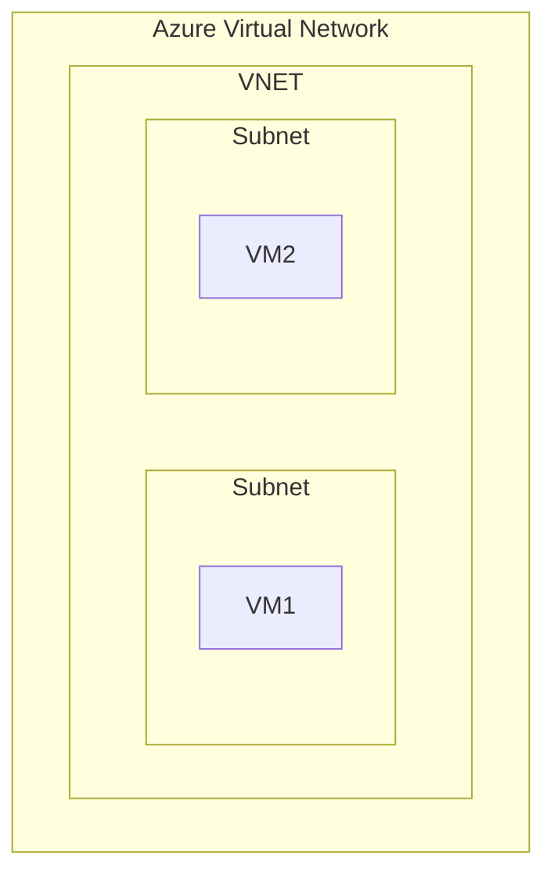

# Networking Services

* Service Categories
  * connect cloud and on-premise
  * protect & monitor
  * application delivery

## Virtual Network (VNET)

* emulation of physical network
* designed for the following between resources
  * isolation
  * communication
  * segmentation (via subnet or by multiple VNETs)
  * filtering (via Network Security Group or Application Security Group)
  * routing
* can have one of more subnets
  * each subnet will have a network interface
  * resources like VM, NSG and IP addresses are attached to Network Interface
* VNET CANNOT span across regions
* VNs can be connected by
  * VNET Peering (two networks are combined to act as one)
  * VPN Gateway

## Load Balancer

* distributes traffic to backend services (VM)
* helps increasing availability
  * eg. VM has `99.9` but when we put them in two Availability Zones and expose via Load Balancer - we get `99.99`
* can be public (with public IP) or internal(private)
* supports inbound and outbound
* supports TCP and UDP (User Datagram Protocol)

## VPN Gateway

* helps to connect VNET to on-premises network
  * done via VPN tunnelling over public internet
* use to connect VNET to VNET is less common

## Application Gateway

* special Load Balancer for web traffic
* supports
  * webapp firewall
  * redirection
  * session affinity
  * URL routing
  * SSL termination

## Content Delivery Network (CDN)

* delivers static web content to users
* minimal latency
* content is distributed to POP (point of presence) locations
  * 120 world-wide