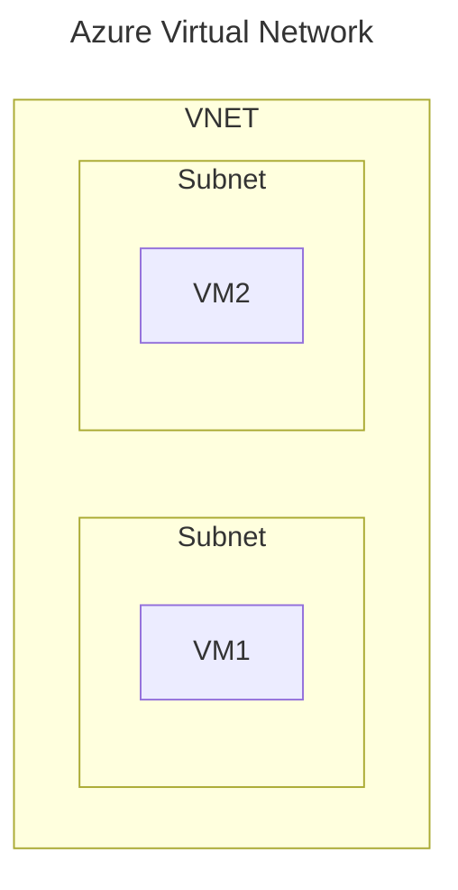

# Networking Services

* Service Categories
  * connect cloud and on-premise
  * protect & monitor
  * application delivery

## Virtual Network (VNET)

* emulation of physical network
* designed for the following between resources
  * isolation
  * communication
  * segmentation (via subnet or by multiple VNETs)
  * filtering (via Network Security Group or Application Security Group)
  * routing
* can have one of more subnets
  * each subnet will have a network interface
  * resources like VM, NSG and IP addresses are attached to Network Interface
* VNET CANNOT span across regions
* VNs can be connected by
  * VNET Peering (two networks are combined to act as one)
  * VPN Gateway

## Load Balancer

## VPN Gateway

## Application Gateway

## Content Delivery Network (CDN)