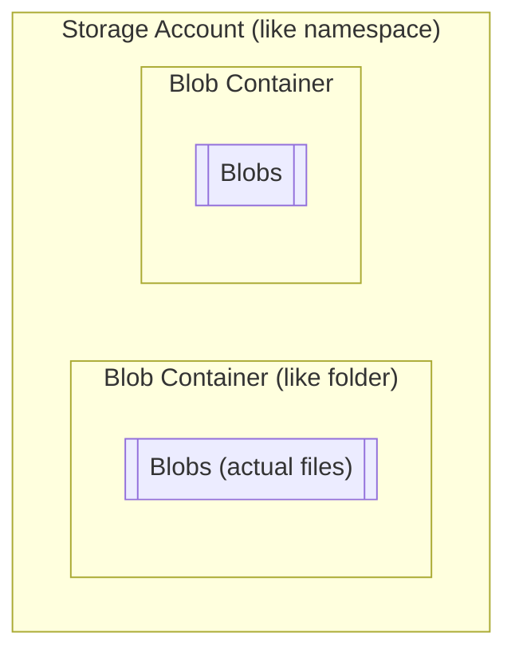
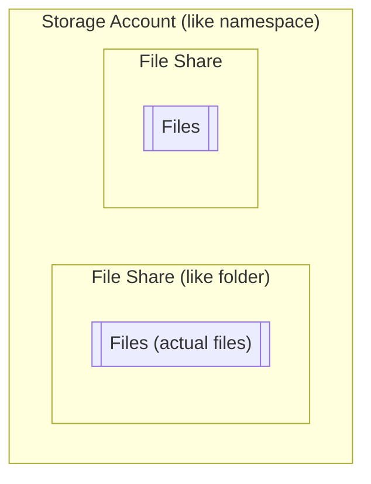

# Azure Storage Services

* Services to store
  * unstructured (data like movie file, etc..) data
  * semi-structured (something like schemaless table) data

## Storage Account

* container (like namespace) for

```mermaid
flowchart TB
subgraph SA["Storage Account (like namespace)"]
    subgraph row1[" "]
        BC("Blob Container")
        FS("File Share")
    end
    subgraph row2[" "]
        QS("Queue Storage")
        TS("Table Storage")
    end
end
classDef transparent stroke-width:0,fill:transparent
classDef blue fill:#0073e6
classDef orange fill:#c44601
classDef green fill:#047e36
classDef purple fill:#7c307f
classDef bg fill:#092941
class SA bg

class row1,row2 transparent
class BC blue
class FS green
class QS orange
class TS purple
```

* following are configured at this level
  * location
  * performance tier standard/premium
  * kind (storageV2, etc..)
  * replication (LRS, GRS)
  * default access tier (hot/cool)

## Azure Blob Storage

* service to store unstructured/blob (binary large object) or any file

* storage tiers (performance/pricing)
  * hot
    * for frequently accessed data
  * cool
    * infrequently accessed data - lower availability but higher durability
    * cheap
  * archive
    * rarely accessed data
    * even less availability (may even take hours)
    * cheapest

## Azure Queue Storage

* simple queue storage for pub-sub

## Azure Table Storage

* for semi-structured data (NoSQL)
* fast read using `PartitionKey` and `RowKey`

## Azure File Storage

* for (remote/cloud) file shares
* part of Azure Storage Account
* similar to blob storage but accessed via SMB protocol
  * SMB (Server Message Block Protocol)
    * client-server communication protocol used for sharing access to files, printer and other network resources

## Azure Disk Storage

* Disk emulation
* used as persistent storage for VM
* different
  * size
  * types (SSD/HDD)
  * performance tiers
  * managed/unmanaged
  * unmanaged means - it is file in blob storage and you need to take care of all aspects of management
* not part of Storage Account