# Database services

For Structured and Semi-structured data

## Azure Cosmos DB

* similar to Table Storage for semi-structure
* `table` is referred to as `collection`
* can be globally replicated/distributed for read and write (multi-regional)
* low-latency - in most cases read takes <10ms
* support multiple API
  * SQL
  * cassandra (NoSQL)
  * MongoDB
  * Gremlin (Graph)
  * Table Storage (useful when migrating from TableStorage to Cosmos)

* **Terminology**
  * SQL server (with small s in sever) is like container for one or more SQL based databases - think of it like a public entry point you connect to

  * SQL Server - (with a S in server) - is a software we install in servers for host SQL Server database

## Azure SQL

* family for products with similar offering

```mermaid
flowchart TB
    subgraph Background["Azure SQL"]
    subgraph row1[" "]
        SQLD[("SQL Database")]
        SQLDM[("SQL Managed Instance")]
        SQLDW[("SQL Datawarehouse")]
    end
    subgraph row2[" "]
        SQLVM[("SQL in VM")]
        MYSQL[("Database for MySQL")]
        PG[("Database for Postgres")]
    end
    end
classDef transparent stroke-width:0,fill:transparent
classDef blue fill:#0073e6,stroke:#0073e6
classDef orange fill:#c44601,stroke:#c44601
classDef green fill:#047e36,stroke:#047e36
classDef purple fill:#7c307f,stroke:#7c307f
classDef bg fill:#101b27,stroke:#101b27
class Background bg
class row1,row2 transparent
```

### Azure SQL Database

* cloud version of Sql Server
* relational PaaS (DaaS)
* only the database is available in Azure
* other services have similar/equivalent cloud services as follows

### Managed Instance

* full features and fully managed

### SQL Datawarehouse

* for big data scenarios