# Azure Market Place

* place for Microsoft and partners to publish there free/commercial product templates
* when a resource is created in Azure, it uses default template from marketplace for that resource
* commercial products include license fee too, so no need to worry about licensing

```mermaid
flowchart LR
    subgraph Background["Commercial Marketplace"]
        subgraph MA["Microsoft Appsource (meant for business users)"]
            a["Power BI"]
            b["Dynamics 365"]
            c["Microsoft 365"]
        end
        subgraph AM["Azure Marketplace (meant for devs)"]
            d["Azure"]
        end
    end
classDef transparent stroke-width:0,fill:transparent
classDef blue fill:#0073e6,stroke:#0073e6
classDef orange fill:#c44601,stroke:#c44601
classDef green fill:#047e36,stroke:#047e36
classDef purple fill:#7c307f,stroke:#7c307f
classDef bg fill:#092941,stroke:#092941
class Background bg
```

