# Big Data and Analytics Services

* Big Data is a field/technology that helps with `extraction`, `processing` and `analysis` of data that is too large or complex for traditional software to deal with
* data with one or more of the following
  * high velocity (grows rapidly)
  * large volume
  * variety (database, video, text, audio, etc...)

## Typical flow for serving data to business to make good decision making

```mermaid
flowchart TB
    subgraph Background["Data Processing workflow"]
       direction TB
       subgraph sources
        direction TB
        files
        dbs
        services
       end 
       subgraph development
        direction LR
        ingest-->transform-->store-->serve
       end
       sources-->development
    end
classDef transparent stroke-width:0,fill:transparent
classDef blue fill:#0073e6,stroke:#0073e6
classDef orange fill:#c44601,stroke:#c44601
classDef green fill:#047e36,stroke:#047e36
classDef purple fill:#7c307f,stroke:#7c307f
classDef bg fill:#092941,stroke:#092941
class Background bg
```

## Azure Synapse Analytics

* Azure Synapse Analytics supports all of these using following and these are backed into Azure Synapse Studio
  * Synapse Pipelines
    * allows ingest and transform using visual workflow
  * Apache Spark
    * a leading tech for big data analytics and transformation
  * Synapse SQL
    * a massively parallel processing SQL Database cluster
      * dedicated or on-demand

```mermaid
flowchart TB
    subgraph Background["Azure Synapse Analytics "]
        direction TB
        subgraph studio["Synapse Studio"]
        direction TB
            pipelines        
            spark
            synapse-sql
        end
        datalake["Azure Data Lake Storage Gen2"]
        studio<-->datalake
        studio<-->datalake
        studio<-->datalake
    end
classDef transparent stroke-width:0,fill:transparent
classDef blue fill:#0073e6,stroke:#0073e6
classDef orange fill:#c44601,stroke:#c44601
classDef green fill:#047e36,stroke:#047e36
classDef purple fill:#7c307f,stroke:#7c307f
classDef bg fill:#101b27,stroke:#101b27
class Background bg
```

## Azure HDInsight

* flexible multi-purpose big data PaaS
* provides big data open source technology cluster for data processing workflow
* Microsoft manges the cluster
* techs can be mix and matched

```mermaid
flowchart TB
    subgraph Background["Azure HDInsight"]
        direction TB
        subgraph technologies
            direction TB
            kafka
            spark
            hadoop
            hive
            hbase
            machine-learning
        end
        bdc["Big Data Cluster"]
        technologies<-->bdc
    end
classDef transparent stroke-width:0,fill:transparent
classDef blue fill:#0073e6,stroke:#0073e6
classDef orange fill:#c44601,stroke:#c44601
classDef green fill:#047e36,stroke:#047e36
classDef purple fill:#7c307f,stroke:#7c307f
classDef bg fill:#101b27,stroke:#101b27
class Background bg
class Background bg
```

## Azure Databricks

* big data collaboration PaaS
* very similar to Azure HDInsight but cluster is only for Apache Spark
* data transformation at large scale
* allows collaboration among users using
  * workspace and
  * notebook

```mermaid
flowchart TB
    subgraph Background["Azure Databricks"]
        direction TB
        as["Apache Spark"]
        bdc["Big Data Cluster"]
        as<-->bdc
    end
classDef transparent stroke-width:0,fill:transparent
classDef blue fill:#0073e6,stroke:#0073e6
classDef orange fill:#c44601,stroke:#c44601
classDef green fill:#047e36,stroke:#047e36
classDef purple fill:#7c307f,stroke:#7c307f
classDef bg fill:#101b27,stroke:#101b27
class Background bg
```

