# Azure AI Services

* AI is simulation of human intelligence & capabilities in computer software

* ML is sub-category of AI where software is taught to draw conclusions
  * teaching is called building a model

## ML Process

```mermaid
flowchart TB
    subgraph Background["ML Process"]
        train-->package-->validate-->deploy-->monitor
    end
classDef transparent stroke-width:0,fill:transparent
classDef blue fill:#0073e6,stroke:#0073e6
classDef orange fill:#c44601,stroke:#c44601
classDef green fill:#047e36,stroke:#047e36
classDef purple fill:#7c307f,stroke:#7c307f
classDef bg fill:#101b27,stroke:#101b27
class Background bg
```

## Azure Machine Learning

* provides tools for the steps above (ML Studio)
  * ML designer
  * notebook (python/R)
  * compute(CPU/GPU)
  * data & management
  * pipeline
* Auto ML - automatically apply many ML algorithms

```mermaid
flowchart TB
    subgraph Background["Azure ML"]
       ml-designer ~~~ notebook ~~~ auto-ml 
    end
classDef transparent stroke-width:0,fill:transparent
classDef blue fill:#0073e6,stroke:#0073e6
classDef orange fill:#c44601,stroke:#c44601
classDef green fill:#047e36,stroke:#047e36
classDef purple fill:#7c307f,stroke:#7c307f
classDef bg fill:#101b27,stroke:#101b27
class Background bg
```

