# Azure Serverless Computing

**Serverless computing** is cloud-hosted executing environment allows running applications in the cloud while abstracting underlying infrastructure

## Azure Functions (Function Apps)

* serverless coding platform (Function as a Service - FaaS)
* for nano-service or event-based architecture
* highly scalable (min:0, max: 200)
* supports many languages

## Azure Logic Apps

* serverless enterprise integration service (PaaS)
* no-code
* allows building workflow using visual interface
* supports
  * branching
  * loops
  * parallel runs
* over 200 connectors available to triggers, interactions and outputs

## Azure Event Grid

* fully managed serverless event routing service
  * pub-sub without worrying underlying infra
* designed for event-based near-realtime
* supports many built-in events from common Azure services

```mermaid
flowchart TB
    subgraph Background["Event Grid Pub/Sub"]
        blob
        azure
        event-hub
        functions
        logic-apps
        webhooks
        grid["Event Grid"]
        blob & azure & event-hub --topics-->grid
        grid --subs--> functions & logic-apps & webhooks
    end
classDef transparent stroke-width:0,fill:transparent
classDef blue fill:#0073e6,stroke:#0073e6
classDef orange fill:#c44601,stroke:#c44601
classDef green fill:#047e36,stroke:#047e36
classDef purple fill:#7c307f,stroke:#7c307f
classDef bg fill:#101b27,stroke:#101b27
class Background bg
```

