# Azure DevOps and DevTest Labs

## Azure Devops

* Collection of services for building solutions using DevOps practices

```mermaid
flowchart LR
    subgraph Background["`DevOps Services`"]
        boards
        pipelines
        repos
        artifacts
        test-plans
    end
classDef transparent stroke-width:0,fill:transparent
classDef blue fill:#0073e6,stroke:#0073e6
classDef orange fill:#c44601,stroke:#c44601
classDef green fill:#047e36,stroke:#047e36
classDef purple fill:#7c307f,stroke:#7c307f
classDef bg fill:#101b27,stroke:#101b27
class Background bg
```

## Azure DevTest Labs

* for devs and testers to quickly provision VM for dev/testing
* software can be pre-installed
* admin can define policies for what can and cannot be configured (cpu, disk, os, quotas) or installed (vscode, oracle)
* can define auto scheduling (auto shutdown) policies
