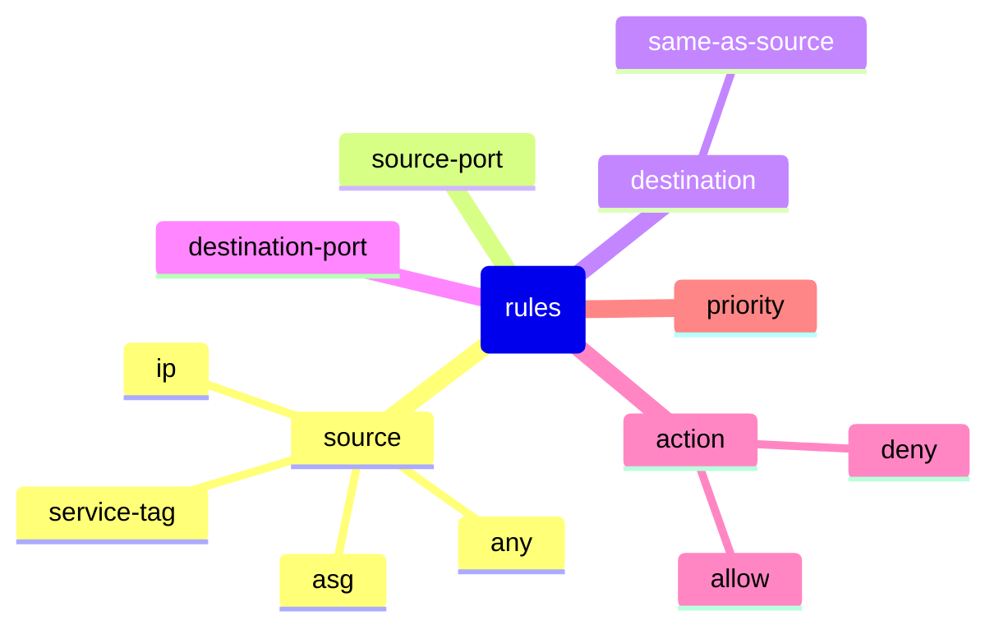
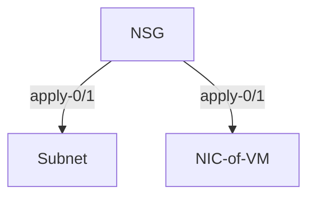

# Azure Security Groups

## Network Security Group

* filter network traffic to and from Azure resources deployed in VNET
* can create multiple NSGs
* each has 0 or more security rules that allow/deny inbound/outbound traffic
* rules have

* apply to subnet or network interface (of VM)

* by default intra-subnet traffic is also subject to NSG rules
  * use `IP Flow Verify` in Azure Network Watcher to see if comms is allowed/denied
