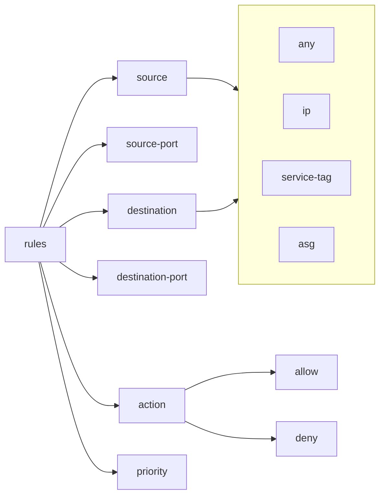
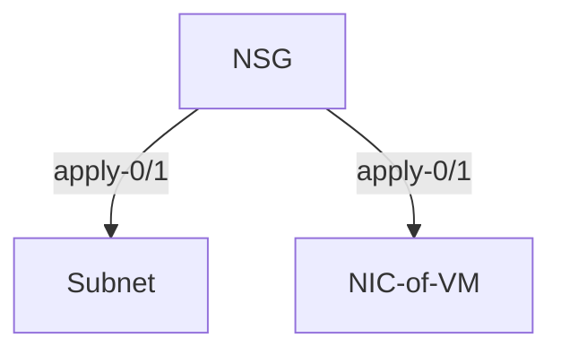

# Azure Security Groups

## Network Security Group

* filter network traffic to and from Azure resources deployed in VNET
* can create multiple NSGs
* each has 0 or more security rules that allow/deny inbound/outbound traffic
* rules have

* service tag
  * group of ip prefixes from a give Azure services
* apply to subnet or network interface (of VM)

* by default intra-subnet traffic is also subject to NSG rules
  * use `IP Flow Verify` in Azure Network Watcher to see if comms is allowed/denied

## Application Security Group (ASG)

* Allows grouping set of resources (like VMs) so NSG can be apply to the whole group instead of specifying each resources (VMs) with their static ips

* reduces effort to maintain NSG as we don't need to track/update static ips whenever VM is added/removed
